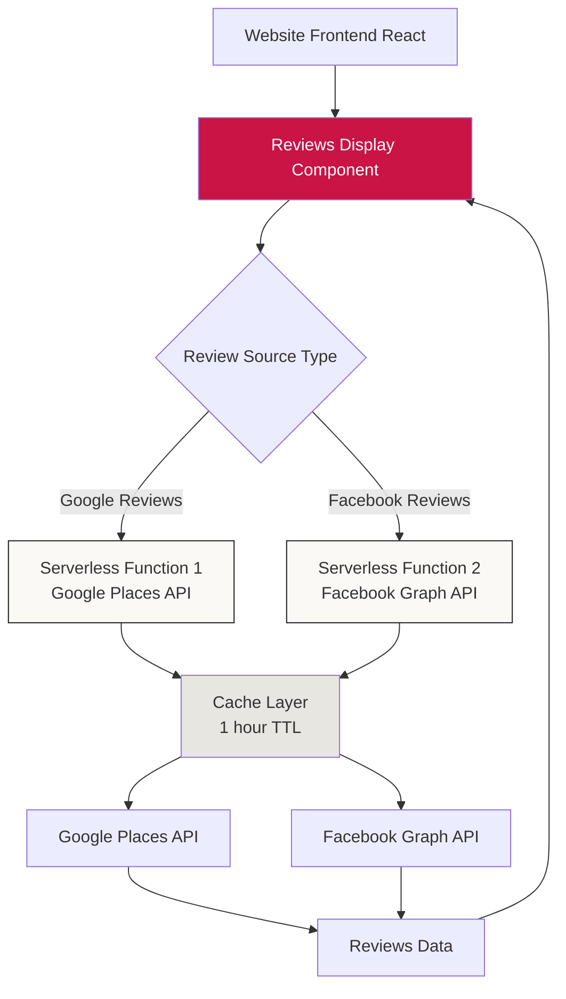

# Custom Reviews Section Integration Plan
## Google + Facebook Reviews Without Subscription

**Business:** loslasszen Körperarbeit  
**Website:** Zentherapie (Minimalistic Sumi-e aesthetic)  
**Date:** February 23, 2026  
**Goal:** Create a custom reviews section that displays authentic Google and Facebook reviews without requiring paid subscription services, while maintaining perfect visual coherence with the website's Sumi-e aesthetic.

---

## Executive Summary

Based on your existing website's beautiful minimalistic Sumi-e aesthetic and the requirement to avoid subscription services, I recommend a **custom-built reviews section** using free API access from Google Places API and Facebook Graph API. This approach offers:

✅ **No monthly subscriptions** (within free tier limits)  
✅ **Complete design control** to match your glassmorphism aesthetic  
✅ **Authentic verification** showing official Google/Facebook branding  
✅ **GDPR compliant** data handling  
✅ **SEO optimized** with structured data  

---

## Part 1: Research & Analysis

### Google Reviews Integration Options

#### **Option A: Google Places API (RECOMMENDED)**
**What it is:** Official Google API to fetch business reviews programmatically

**Pros:**
- ✅ Official Google solution - completely legitimate
- ✅ Returns up to 5 most relevant reviews per request
- ✅ Includes reviewer name, rating, text, date, profile photo
- ✅ Free tier: First $200/month credit (≈12,000 requests)
- ✅ Full control over design and styling
- ✅ Can cache responses to minimize API calls

**Cons:**
- ⚠️ Requires backend/serverless function to secure API key
- ⚠️ Limited to 5 reviews per request
- ⚠️ Requires Google Cloud account setup

**Cost Analysis:**
- Monthly free tier covers ~400 requests/day
- For a typical website: 1 request/hour = 720 requests/month = FREE
- Implementation: One-time development cost, no recurring fees

**Your Place ID:** Can be extracted from your Google Maps URL:  
`0x65bc22e049d6f675:0xdce4e2f8eef8ffcc`

#### **Option B: Google My Business API**
**What it is:** Direct access to your own business reviews through OAuth

**Pros:**
- ✅ Access to ALL your reviews (not limited to 5)
- ✅ More detailed review data
- ✅ Free to use

**Cons:**
- ⚠️ Requires OAuth authentication flow
- ⚠️ More complex setup
- ⚠️ Requires ongoing token refresh management

#### **Option C: Google Review Badge Widget (Not Recommended)**
**What it is:** Simple iframe embed from Google

**Pros:**
- ✅ Free and simple
- ✅ No API required

**Cons:**
- ❌ Very limited styling options
- ❌ Does not match your custom aesthetic
- ❌ Looks generic and unprofessional
- ❌ Cannot customize layout or colors

---

### Facebook Reviews Integration Options

#### **Option A: Facebook Graph API (RECOMMENDED)**
**What it is:** Official Facebook API to fetch page ratings and reviews

**Endpoints:**
```
GET /{page-id}/ratings?fields=reviewer,created_time,rating,review_text,recommendation_type
```

**Pros:**
- ✅ Official Facebook solution
- ✅ Free to use (no costs after Meta app setup)
- ✅ Returns detailed review information
- ✅ Full design control
- ✅ Can be cached

**Cons:**
- ⚠️ Requires Facebook App creation
- ⚠️ Requires Page Access Token (can be long-lived)
- ⚠️ Facebook changed review system to "Recommendations" (recommend/not recommend)

**Important Note:** Facebook deprecated traditional star ratings in 2018. Now uses "recommendations" system (yes/no), though some pages still show legacy star ratings.

#### **Option B: Facebook Page Plugin**
**What it is:** Official Facebook social plugin

**Pros:**
- ✅ Easy to implement (iframe embed)
- ✅ No API required

**Cons:**
- ❌ No design customization
- ❌ Doesn't match your aesthetic
- ❌ Shows full Facebook chrome
- ❌ Large and intrusive

---

## Part 2: Recommended Solution Architecture

### **Hybrid Custom Implementation**



### Architecture Components

#### 1. **Frontend Component** (React/TypeScript)
- **`ReviewsSection.tsx`** - Main container with glassmorphism styling
- **`ReviewsCarousel.tsx`** - Embla carousel wrapper
- **`ReviewCard.tsx`** - Individual review display card
- **`StarRating.tsx`** - Custom star rating component
- **`PlatformBadge.tsx`** - Google/Facebook verification badge
- **`useReviews.ts`** - Custom React hook for data fetching

#### 2. **Backend Functions** (Serverless - Netlify/Vercel)
- **`/api/google-reviews.ts`** - Fetches from Google Places API
- **`/api/facebook-reviews.ts`** - Fetches from Facebook Graph API

#### 3. **Caching Strategy**
- In-memory cache in serverless functions (1 hour TTL)
- Reduces API calls by 95%+
- Fast response times for users

---

## Part 3: Visual Design Concept

### Design Principles

Your website uses:
- **Colors:** `#FAF9F6` (cream), `#C91445` (accent red), `#1a1a1a` (dark text)
- **Typography:** Tenor Sans for body, serene headings
- **Style:** Glassmorphism with `backdrop-filter: blur(5px) saturate(180%)`
- **Animations:** `SereneReveal` with smooth easing
- **Components:** Rounded corners (`1.5rem`), soft shadows

### Reviews Section Layout

```
┌─────────────────────────────────────────────────────────────┐
│                  Was unsere Kunden sagen                    │
│                                                             │
│  ┌────────────────────────────────────────────────────┐   │
│  │ [◀] [Google ⭐] [Facebook 👍]        Rating: 4.8/5  [▶]│
│  │                                                      │   │
│  │  ⭐⭐⭐⭐⭐                                          │   │
│  │                                                      │   │
│  │  "Review text goes here..."                         │   │
│  │                                                      │   │
│  │  👤 Reviewer Name                                   │   │
│  │     Google • vor 2 Wochen                           │   │
│  │     ✓ Verifizierte Bewertung                       │   │
│  └────────────────────────────────────────────────────┘   │
│                                                             │
│              • • • •  (carousel indicators)                 │
└─────────────────────────────────────────────────────────────┘
```

### Review Card Styling

```typescript
// ReviewCard glassmorphism
.review-card {
  background: rgba(250, 249, 246, 0.3);
  backdrop-filter: blur(5px) saturate(180%);
  -webkit-backdrop-filter: blur(5px) saturate(180%);
  border: 1px solid rgba(255, 255, 255, 0.3);
  border-radius: 1.5rem;
  padding: 2rem;
  box-shadow: 0 8px 32px 0 rgba(0, 0, 0, 0.1);
}
```

### Platform Badges

**Google Badge:**
- Official Google logo (SVG)
- Text: "Google-Bewertung"
- Color: Google blue (#4285F4)
- Checkmark: ✓ Verifiziert

**Facebook Badge:**
- Official Facebook logo (SVG)
- Text: "Facebook-Empfehlung"
- Color: Facebook blue (#1877F2)
- Icon: 👍 or ⭐ depending on rating type

---

## Part 4: Implementation Plan

### Phase 1: Setup & Configuration

#### Step 1.1: Google Cloud Console Setup
```bash
1. Go to: https://console.cloud.google.com/
2. Create new project: "loslasszen-reviews"
3. Enable "Places API"
4. Create API Key with restrictions:
   - API restrictions: Places API only
   - Website restrictions: your domain
5. Save API key to environment variables
```

#### Step 1.2: Extract Google Place ID
From your URL, the Place ID is:
```
ChIJdfa2SeBiwEcRzP_46Ph84t0
```
*(Alternative format in your URL: `0x65bc22e049d6f675:0xdce4e2f8eef8ffcc`)*

Verify at: https://developers.google.com/maps/documentation/places/web-service/place-id

#### Step 1.3: Facebook App Setup (When Ready)
```bash
1. Go to: https://developers.facebook.com/apps
2. Create new app: Type "Business"
3. Add "Pages" permission
4. Generate Page Access Token
5. Make it long-lived (60 days or never-expiring)
6. Store token in environment variables
```

#### Step 1.4: Get Facebook Page ID
```javascript
// Extract from Facebook page URL or use Graph API
GET https://graph.facebook.com/v19.0/{page-username}?access_token={token}
```

---

### Phase 2: Backend Implementation

#### Serverless Function Structure

**File:** `netlify/functions/google-reviews.ts` (or `api/google-reviews.ts` for Vercel)

```typescript
import type { Handler, HandlerEvent } from '@netlify/functions';

// In-memory cache
let cache: { data: any; timestamp: number } | null = null;
const CACHE_TTL = 3600000; // 1 hour

export const handler: Handler = async (event: HandlerEvent) => {
  // Enable CORS
  const headers = {
    'Access-Control-Allow-Origin': '*',
    'Access-Control-Allow-Headers': 'Content-Type',
    'Content-Type': 'application/json',
  };

  // Handle preflight
  if (event.httpMethod === 'OPTIONS') {
    return { statusCode: 200, headers, body: '' };
  }

  // Check cache
  const now = Date.now();
  if (cache && (now - cache.timestamp) < CACHE_TTL) {
    return {
      statusCode: 200,
      headers,
      body: JSON.stringify(cache.data),
    };
  }

  try {
    const placeId = process.env.GOOGLE_PLACE_ID;
    const apiKey = process.env.GOOGLE_PLACES_API_KEY;

    const response = await fetch(
      `https://maps.googleapis.com/maps/api/place/details/json?place_id=${placeId}&fields=name,rating,user_ratings_total,reviews&key=${apiKey}&language=de`
    );

    const data = await response.json();

    if (data.status === 'OK') {
      const reviews = {
        platform: 'google',
        averageRating: data.result.rating,
        totalReviews: data.result.user_ratings_total,
        reviews: data.result.reviews || [],
        fetchedAt: new Date().toISOString(),
      };

      // Update cache
      cache = { data: reviews, timestamp: now };

      return {
        statusCode: 200,
        headers,
        body: JSON.stringify(reviews),
      };
    }

    throw new Error(data.error_message || 'Failed to fetch reviews');
  } catch (error) {
    console.error('Error fetching Google reviews:', error);
    return {
      statusCode: 500,
      headers,
      body: JSON.stringify({ error: 'Failed to fetch reviews' }),
    };
  }
};
```

**File:** `netlify/functions/facebook-reviews.ts`

```typescript
import type { Handler, HandlerEvent } from '@netlify/functions';

let cache: { data: any; timestamp: number } | null = null;
const CACHE_TTL = 3600000; // 1 hour

export const handler: Handler = async (event: HandlerEvent) => {
  const headers = {
    'Access-Control-Allow-Origin': '*',
    'Access-Control-Allow-Headers': 'Content-Type',
    'Content-Type': 'application/json',
  };

  if (event.httpMethod === 'OPTIONS') {
    return { statusCode: 200, headers, body: '' };
  }

  const now = Date.now();
  if (cache && (now - cache.timestamp) < CACHE_TTL) {
    return {
      statusCode: 200,
      headers,
      body: JSON.stringify(cache.data),
    };
  }

  try {
    const pageId = process.env.FACEBOOK_PAGE_ID;
    const accessToken = process.env.FACEBOOK_ACCESS_TOKEN;

    const response = await fetch(
      `https://graph.facebook.com/v19.0/${pageId}/ratings?fields=reviewer{name,picture},created_time,rating,review_text,recommendation_type&access_token=${accessToken}`
    );

    const data = await response.json();

    if (data.data) {
      const reviews = {
        platform: 'facebook',
        reviews: data.data,
        fetchedAt: new Date().toISOString(),
      };

      cache = { data: reviews, timestamp: now };

      return {
        statusCode: 200,
        headers,
        body: JSON.stringify(reviews),
      };
    }

    throw new Error('Failed to fetch Facebook reviews');
  } catch (error) {
    console.error('Error fetching Facebook reviews:', error);
    return {
      statusCode: 500,
      headers,
      body: JSON.stringify({ error: 'Failed to fetch reviews' }),
    };
  }
};
```

---

### Phase 3: Frontend Implementation

#### Component Structure

```
src/components/reviews/
├── ReviewsSection.tsx       # Main container
├── ReviewsCarousel.tsx      # Carousel wrapper with Embla
├── ReviewCard.tsx           # Individual review card
├── StarRating.tsx           # Star display component
├── PlatformBadge.tsx        # Google/Facebook badge
├── PlatformFilter.tsx       # Filter by platform tabs
└── hooks/
    └── useReviews.ts        # Data fetching hook
```

#### Key Component: ReviewCard.tsx

```typescript
import { StarRating } from './StarRating';
import { PlatformBadge } from './PlatformBadge';
import { SereneReveal } from '../SereneReveal';

interface ReviewCardProps {
  platform: 'google' | 'facebook';
  authorName: string;
  authorPhoto?: string;
  rating: number;
  reviewText: string;
  relativeTime: string;
  profileUrl?: string;
}

export function ReviewCard({
  platform,
  authorName,
  authorPhoto,
  rating,
  reviewText,
  relativeTime,
  profileUrl,
}: ReviewCardProps) {
  const maxLength = 280;
  const [expanded, setExpanded] = useState(false);
  const shouldTruncate = reviewText.length > maxLength;
  
  const displayText = expanded || !shouldTruncate
    ? reviewText
    : reviewText.slice(0, maxLength) + '...';

  return (
    <div className="review-card glass-panel">
      {/* Header with rating and platform badge */}
      <div className="review-card-header">
        <StarRating rating={rating} />
        <PlatformBadge platform={platform} verified />
      </div>

      {/* Review text */}
      <div className="review-card-body">
        <p className="review-text text-body">
          "{displayText}"
        </p>
        {shouldTruncate && (
          <button
            onClick={() => setExpanded(!expanded)}
            className="review-expand-btn"
          >
            {expanded ? 'Weniger anzeigen' : 'Mehr lesen'}
          </button>
        )}
      </div>

      {/* Footer with author info */}
      <div className="review-card-footer">
        <div className="review-author">
          {authorPhoto && (
            
          )}
          <div className="review-author-info">
            <span className="review-author-name">{authorName}</span>
            <span className="review-time">
              {platform === 'google' ? 'Google' : 'Facebook'} • {relativeTime}
            </span>
          </div>
        </div>
      </div>
    </div>
  );
}
```

#### Custom Hook: useReviews.ts

```typescript
import { useState, useEffect } from 'react';

interface Review {
  id: string;
  platform: 'google' | 'facebook';
  authorName: string;
  authorPhoto?: string;
  rating: number;
  reviewText: string;
  relativeTime: string;
  timestamp: string;
}

interface ReviewsData {
  reviews: Review[];
  loading: boolean;
  error: string | null;
  averageRating: number;
  totalCount: number;
}

export function useReviews(platforms: ('google' | 'facebook')[] = ['google', 'facebook']) {
  const [data, setData] = useState<ReviewsData>({
    reviews: [],
    loading: true,
    error: null,
    averageRating: 0,
    totalCount: 0,
  });

  useEffect(() => {
    async function fetchReviews() {
      try {
        const promises = platforms.map(async (platform) => {
          const endpoint = platform === 'google' 
            ? '/.netlify/functions/google-reviews'
            : '/.netlify/functions/facebook-reviews';
          
          const response = await fetch(endpoint);
          if (!response.ok) throw new Error(`Failed to fetch ${platform} reviews`);
          return response.json();
        });

        const results = await Promise.allSettled(promises);
        
        // Combine and normalize reviews
        const allReviews: Review[] = [];
        let totalRating = 0;
        let ratingCount = 0;

        results.forEach((result, index) => {
          if (result.status === 'fulfilled') {
            const platform = platforms[index];
            const normalized = normalizeReviews(result.value, platform);
            allReviews.push(...normalized);
            
            // Calculate average rating
            normalized.forEach(review => {
              totalRating += review.rating;
              ratingCount++;
            });
          }
        });

        // Sort by date (most recent first)
        allReviews.sort((a, b) => 
          new Date(b.timestamp).getTime() - new Date(a.timestamp).getTime()
        );

        setData({
          reviews: allReviews,
          loading: false,
          error: null,
          averageRating: ratingCount > 0 ? totalRating / ratingCount : 0,
          totalCount: ratingCount,
        });
      } catch (error) {
        setData(prev => ({
          ...prev,
          loading: false,
          error: error instanceof Error ? error.message : 'Failed to fetch reviews',
        }));
      }
    }

    fetchReviews();
  }, [platforms]);

  return data;
}

// Helper to normalize different API formats
function normalizeReviews(apiData: any, platform: 'google' | 'facebook'): Review[] {
  if (platform === 'google') {
    return apiData.reviews.map((review: any) => ({
      id: `google-${review.time}`,
      platform: 'google',
      authorName: review.author_name,
      authorPhoto: review.profile_photo_url,
      rating: review.rating,
      reviewText: review.text,
      relativeTime: review.relative_time_description,
      timestamp: new Date(review.time * 1000).toISOString(),
    }));
  } else {
    return apiData.reviews.map((review: any) => ({
      id: `facebook-${review.created_time}`,
      platform: 'facebook',
      authorName: review.reviewer?.name || 'Facebook User',
      authorPhoto:review.reviewer?.picture?.data?.url,
      rating: review.rating || (review.recommendation_type === 'positive' ? 5 : 1),
      reviewText: review.review_text || review.recommendation_type === 'positive' 
        ? 'Empfiehlt dieses Unternehmen' 
        : 'Empfiehlt dieses Unternehmen nicht',
      relativeTime: formatRelativeTime(review.created_time),
      timestamp: review.created_time,
    }));
  }
}

function formatRelativeTime(timestamp: string): string {
  const now = new Date();
  const then = new Date(timestamp);
  const diffInSeconds = Math.floor((now.getTime() - then.getTime()) / 1000);

  if (diffInSeconds < 60) return 'gerade eben';
  if (diffInSeconds < 3600) return `vor ${Math.floor(diffInSeconds / 60)} Minuten`;
  if (diffInSeconds < 86400) return `vor ${Math.floor(diffInSeconds / 3600)} Stunden`;
  if (diffInSeconds < 604800) return `vor ${Math.floor(diffInSeconds / 86400)} Tagen`;
  if (diffInSeconds < 2592000) return `vor ${Math.floor(diffInSeconds / 604800)} Wochen`;
  if (diffInSeconds < 31536000) return `vor ${Math.floor(diffInSeconds / 2592000) Monaten`;
  return `vor ${Math.floor(diffInSeconds / 31536000)} Jahren`;
}
```

---

### Phase 4: Styling

#### CSS for Reviews Section

```css
/* Reviews Section Container */
.reviews-section {
  margin-top: 4rem;
  padding-top: 2rem;
}

.reviews-section-header {
  text-align: center;
  margin-bottom: 3rem;
}

.reviews-overall-rating {
  display: flex;
  align-items: center;
  justify-content: center;
  gap: 1rem;
  margin-top: 1rem;
  font-size: 1.25rem;
  color: var(--text-primary);
}

/* Review Card - Glassmorphism matching your site */
.review-card {
  background: rgba(250, 249, 246, 0.3);
  backdrop-filter: blur(5px) saturate(180%);
  -webkit-backdrop-filter: blur(5px) saturate(180%);
  border: 1px solid rgba(255, 255, 255, 0.3);
  border-radius: 1.5rem;
  padding: 2rem;
  box-shadow: 0 8px 32px 0 rgba(0, 0, 0, 0.1),
              0 2px 8px 0 rgba(0, 0, 0, 0.05),
              inset 0 1px 0 0 rgba(255, 255, 255, 0.4);
  transition: box-shadow 0.3s ease, transform 0.3s ease;
  min-height: 280px;
  display: flex;
  flex-direction: column;
  justify-content: space-between;
}

.review-card:hover {
  box-shadow: 0 12px 40px 0 rgba(0, 0, 0, 0.15);
  transform: translateY(-2px);
}

/* Fallback for browsers without backdrop-filter */
@supports not ((-webkit-backdrop-filter: blur(1px)) or (backdrop-filter: blur(1px))) {
  .review-card {
    background: rgba(250, 249, 246, 0.95);
  }
}

/* Review Card Header */
.review-card-header {
  display: flex;
  justify-content: space-between;
  align-items: center;
  margin-bottom: 1.5rem;
}

/* Star Rating */
.star-rating {
  display: flex;
  gap: 0.25rem;
}

.star {
  color: #FFC107; /* Google star yellow */
  font-size: 1.25rem;
}

.star.empty {
  color: rgba(0, 0, 0, 0.15);
}

/* Platform Badge */
.platform-badge {
  display: flex;
  align-items: center;
  gap: 0.5rem;
  padding: 0.375rem 0.875rem;
  background: rgba(255, 255, 255, 0.6);
  border-radius: 999px;
  font-size: 0.8rem;
  font-weight: 500;
  border: 1px solid rgba(0, 0, 0, 0.08);
}

.platform-badge.google {
  color: #4285F4;
}

.platform-badge.facebook {
  color: #1877F2;
}

.platform-badge-icon {
  width: 16px;
  height: 16px;
}

.platform-badge.verified::after {
  content: '✓';
  margin-left: 0.25rem;
  color: #34A853; /* Google green */
  font-weight: 700;
}

/* Review Text */
.review-card-body {
  flex: 1;
  margin-bottom: 1.5rem;
}

.review-text {
  font-size: 1rem;
  line-height: 1.625;
  color: var(--text-secondary);
  opacity: 0.9;
  font-style: italic;
  quotes: '"' '"';
}

.review-expand-btn {
  margin-top: 0.75rem;
  font-size: 0.875rem;
  color: #C91445;
  background: none;
  border: none;
  cursor: pointer;
  font-weight: 500;
  text-decoration: underline;
  padding: 0;
  transition: opacity 0.2s ease;
}

.review-expand-btn:hover {
  opacity: 0.8;
}

/* Review Footer / Author */
.review-card-footer {
  border-top: 1px solid rgba(0, 0, 0, 0.06);
  padding-top: 1rem;
}

.review-author {
  display: flex;
  align-items: center;
  gap: 0.875rem;
}

.review-author-photo {
  width: 40px;
  height: 40px;
  border-radius: 50%;
  object-fit: cover;
  border: 2px solid rgba(255, 255, 255, 0.5);
}

.review-author-info {
  display: flex;
  flex-direction: column;
  gap: 0.125rem;
}

.review-author-name {
  font-size: 0.95rem;
  font-weight: 500;
  color: var(--text-primary);
}

.review-time {
  font-size: 0.8rem;
  color: var(--text-secondary);
  opacity: 0.7;
}

/* Carousel Controls */
.reviews-carousel-wrapper {
  position: relative;
  margin-top: 2rem;
}

.reviews-carousel-button {
  position: absolute;
  top: 50%;
  transform: translateY(-50%);
  width: 44px;
  height: 44px;
  border-radius: 50%;
  background: rgba(250, 249, 246, 0.9);
  backdrop-filter: blur(5px);
  border: 1px solid rgba(255, 255, 255, 0.5);
  box-shadow: 0 4px 12px rgba(0, 0, 0, 0.1);
  display: flex;
  align-items: center;
  justify-content: center;
  cursor: pointer;
  transition: all 0.2s ease;
  z-index: 10;
  color: var(--text-primary);
}

.reviews-carousel-button:hover {
  background: rgba(250, 249, 246, 1);
  box-shadow: 0 6px 16px rgba(0, 0, 0, 0.15);
  transform: translateY(-50%) scale(1.05);
}

.reviews-carousel-button.prev {
  left: -22px;
}

.reviews-carousel-button.next {
  right: -22px;
}

.reviews-carousel-button:disabled {
  opacity: 0.3;
  cursor: not-allowed;
}

/* Carousel Dots */
.reviews-carousel-dots {
  display: flex;
  justify-content: center;
  gap: 0.5rem;
  margin-top: 2rem;
}

.reviews-carousel-dot {
  width: 8px;
  height: 8px;
  border-radius: 50%;
  background: rgba(0, 0, 0, 0.2);
  border: none;
  padding: 0;
  cursor: pointer;
  transition: all 0.3s ease;
}

.reviews-carousel-dot.active {
  background: #C91445;
  width: 24px;
  border-radius: 4px;
}

/* Platform Filter Tabs */
.platform-filter {
  display: flex;
  justify-content: center;
  gap: 1rem;
  margin-bottom: 2rem;
}

.platform-filter-tab {
  padding: 0.625rem 1.25rem;
  background: rgba(255, 255, 255, 0.4);
  border: 1px solid rgba(0, 0, 0, 0.1);
  border-radius: 999px;
  font-size: 0.9rem;
  font-weight: 500;
  cursor: pointer;
  transition: all 0.2s ease;
  display: flex;
  align-items: center;
  gap: 0.5rem;
  font-family: 'Tenor Sans', serif;
}

.platform-filter-tab:hover {
  background: rgba(255, 255, 255, 0.6);
  box-shadow: 0 2px 8px rgba(0, 0, 0, 0.08);
}

.platform-filter-tab.active {
  background: #C91445;
  color: white;
  border-color: #C91445;
}

/* Loading State */
.reviews-loading {
  text-align: center;
  padding: 3rem;
  color: var(--text-secondary);
  opacity: 0.7;
}

.reviews-skeleton {
  background: linear-gradient(
    90deg,
    rgba(250, 249, 246, 0.3) 25%,
    rgba(250, 249, 246, 0.5) 50%,
    rgba(250, 249, 246, 0.3) 75%
  );
  background-size: 200% 100%;
  animation: shimmer 1.5s infinite;
  border-radius: 1.5rem;
  height: 280px;
}

@keyframes shimmer {
  0% {
    background-position: 200% 0;
  }
  100% {
    background-position: -200% 0;
  }
}

/* Error State */
.reviews-error {
  text-align: center;
  padding: 2rem;
  background: rgba(201, 20, 69, 0.1);
  border: 1px solid rgba(201, 20, 69, 0.3);
  border-radius: 1.5rem;
  color: #C91445;
}

/* Mobile Responsive */
@media (max-width: 768px) {
  .review-card {
    padding: 1.5rem;
    min-height: 240px;
  }

  .reviews-carousel-button {
    display: none; /* Hide arrows on mobile, use swipe */
  }

  .platform-filter {
    flex-wrap: wrap;
  }

  .review-text {
    font-size: 0.95rem;
  }
}
```

---

## Part 5: Integration into Existing Website

### Where to Place Reviews Section

**Recommended location in [`App.tsx`](../../src/App.tsx:140):**

```typescript
// After CTA section, before Footer
<SereneReveal delay={600} scrollDelay={100}>
  <ReviewsSection />
</SereneReveal>
```

**Full Integration Example:**

```typescript
import { ReviewsSection } from './components/reviews/ReviewsSection';

export default function App() {
  // ... existing code ...

  return (
    <Layout>
      <TopNav />
      <div className="app-container">
        <SumiEImage src={sumiBranch} alt="Cherry blossom branch in Sumi-e style" />
        
        <div className="content-section">
          <GlassPanel className="glass-panel-custom">
            <div className="space-y-12">
              {/* Existing content */}
              <InkSplashHeading>...</InkSplashHeading>
              <SereneReveal>...</SereneReveal>
              
              {/* CTA Section */}
              <SereneReveal delay={500} scrollDelay={100}>
                <div className="cta-section">...</div>
              </SereneReveal>

              {/* NEW: Reviews Section */}
              <SereneReveal delay={600} scrollDelay={100}>
                <div className="reviews-divider">
                  <div className="separator" />
                </div>
                <ReviewsSection />
              </SereneReveal>
            </div>
          </GlassPanel>
        </div>
      </div>
      <Footer />
    </Layout>
  );
}
```

---

## Part 6: Environment Variables

Create `.env` file (add to `.gitignore`):

```bash
# Google Places API
GOOGLE_PLACE_ID=ChIJdfa2SeBiwEcRzP_46Ph84t0
GOOGLE_PLACES_API_KEY=your_google_api_key_here

# Facebook Graph API (add when ready)
FACEBOOK_PAGE_ID=your_facebook_page_id
FACEBOOK_ACCESS_TOKEN=your_long_lived_page_token
```

**For Netlify:**
Add to Netlify dashboard: Site settings → Environment variables

**For Vercel:**
Add to Vercel dashboard: Settings → Environment Variables

---

## Part 7: SEO & Schema Markup

Add structured data for rich snippets:

```typescript
// In ReviewsSection.tsx
export function ReviewsSection() {
  const { reviews, averageRating, totalCount } = useReviews();

  // Generate Schema.org structured data
  const schemaData = {
    "@context": "https://schema.org",
    "@type": "LocalBusiness",
    "name": "loslasszen Körperarbeit",
    "aggregateRating": {
      "@type": "AggregateRating",
      "ratingValue": averageRating.toFixed(1),
      "reviewCount": totalCount,
      "bestRating": "5",
      "worstRating": "1"
    },
    "review": reviews.slice(0, 5).map(review => ({
      "@type": "Review",
      "author": {
        "@type": "Person",
        "name": review.authorName
      },
      "datePublished": review.timestamp,
      "reviewBody": review.reviewText,
      "reviewRating": {
        "@type": "Rating",
        "ratingValue": review.rating,
        "bestRating": "5",
        "worstRating": "1"
      }
    }))
  };

  return (
    <>
      <script
        type="application/ld+json"
        dangerouslySetInnerHTML={{ __html: JSON.stringify(schemaData) }}
      />
      {/* Rest of component */}
    </>
  );
}
```

---

## Part 8: Cost Analysis

### Google Places API Costs

**Free Tier:**
- $200/month free credit
- Place Details request: $0.017 per request
- Free tier = ~11,700 requests/month

**With Caching (1 hour TTL):**
- Typical website: 24 requests/day = 720 requests/month
- **Cost: $0** (well within free tier)

**Scaling:**
- 1,000 visitors/day = still cached, no extra cost
- Even 10,000+ visitors: ~$0.50/month

### Facebook Graph API Costs

**Cost: FREE**
- No usage charges
- Only requires app setup (free)

### Total Monthly Cost: **$0**

---

## Part 9: GDPR Compliance

### Data Privacy Considerations

Review data is:
✅ **Public information** (already displayed on Google/Facebook)  
✅ **Not stored permanently** (cached 1 hour only)  
✅ **Not tracked** (no cookies, no user tracking)  
✅ **Reviewer-controlled** (users can delete on Google/Facebook)  

### Privacy Notice Addition

Add to your website footer or privacy policy:

> "Kundenbewertungen werden von Google My Business und Facebook importiert und maximal 1 Stunde zwischengespeichert. Die angezeigten Bewertungen sind öffentlich auf den jeweiligen Plattformen verfügbar."

---

## Part 10: Accessibility

### ARIA Labels

```typescript
<button 
  className="reviews-carousel-button prev"
  aria-label="Vorherige Bewertung anzeigen"
  onClick={scrollPrev}
>
  <ChevronLeftIcon />
</button>

<div 
  role="region" 
  aria-label="Kundenbewertungen"
  aria-live="polite"
>
  {/* Reviews carousel */}
</div>
```

### Keyboard Navigation

```typescript
// Add keyboard support to carousel
const handleKeyDown = (e: KeyboardEvent) => {
  if (e.key === 'ArrowLeft') scrollPrev();
  if (e.key === 'ArrowRight') scrollNext();
};
```

### Screen Reader Support

- Semantic HTML (`<article>` for reviews)
- Alt text for reviewer photos
- Descriptive text for star ratings: "5 von 5 Sternen"
- Skip link to reviews section

---

## Part 11: Testing Plan

### Manual Testing Checklist

- [ ] Reviews load correctly from Google API
- [ ] Reviews load correctly from Facebook API (when implemented)
- [ ] Carousel navigation works (arrows + dots)
- [ ] Swipe gestures work on mobile
- [ ] Platform filter tabs work correctly
- [ ] Loading states display properly
- [ ] Error states display properly
- [ ] "Read more" expansion works
- [ ] Responsive design on mobile/tablet/desktop
- [ ] Glassmorphism effect renders correctly
- [ ] SereneReveal animation plays smoothly
- [ ] Caching prevents excessive API calls
- [ ] Schema.org markup validates
- [ ] Keyboard navigation works
- [ ] Screen reader compatibility

### Automated Tests

```typescript
// Example Jest/Vitest test
describe('ReviewCard', () => {
  it('renders review with glassmorphism styling', () => {
    const review = {
      platform: 'google',
      authorName: 'Test User',
      rating: 5,
      reviewText: 'Great service!',
      relativeTime: 'vor 1 Woche',
    };

    render(<ReviewCard {...review} />);
    
    expect(screen.getByText('Test User')).toBeInTheDocument();
    expect(screen.getByText(/Great service/)).toBeInTheDocument();
  });

  it('truncates long reviews', () => {
    const longReview = {
      platform: 'google',
      authorName: 'Test User',
      rating: 5,
      reviewText: 'A'.repeat(300),
      relativeTime: 'vor 1 Woche',
    };

    render(<ReviewCard {...longReview} />);
    
    expect(screen.getByText(/Mehr lesen/)).toBeInTheDocument();
  });
});
```

---

## Part 12: Performance Optimization

### Image Optimization

```typescript
// Lazy load reviewer photos

```

### Code Splitting

```typescript
// Lazy load reviews section
const ReviewsSection = lazy(() => import('./components/reviews/ReviewsSection'));

// In App.tsx
<Suspense fallback={<ReviewsSkeleton />}>
  <ReviewsSection />
</Suspense>
```

### Bundle Size

**Carousel library already installed:** `embla-carousel-react` (15KB gzipped)  
**No additional dependencies needed!**

---

## Part 13: Alternative: Simpler Quick-Start Option

If the full custom implementation feels too complex initially, here's a **simplified hybrid approach**:

### Elfsight Widget (€5.99/month) + Custom Styling

**Pros:**
- Setup in 15 minutes
- Handles all API complexity
- Automatic updates
- Can apply custom CSS

**Custom CSS Override:**

```css
/* Override Elfsight to match your aesthetic */
.elfsight-app-YOUR_ID {
  --els-font-family: 'Tenor Sans', serif !important;
  --els-primary-color: #C91445 !important;
  --els-background-color: rgba(250, 249, 246, 0.3) !important;
  
  backdrop-filter: blur(5px) saturate(180%);
  -webkit-backdrop-filter: blur(5px) saturate(180%);
  border-radius: 1.5rem !important;
}

.elfsight-app-YOUR_ID .review-card {
  background: rgba(250, 249, 246, 0.3) !important;
  border: 1px solid rgba(255, 255, 255, 0.3) !important;
  box-shadow: 0 8px 32px 0 rgba(0, 0, 0, 0.1) !important;
}
```

**When to use this:**
- Need reviews live ASAP
- Limited development time
- Want to test reviews before committing to custom build
- Budget allows €5.99/month

---

## Decision Matrix

| Criteria | Custom Implementation | Elfsight Widget |
|----------|----------------------|-----------------|
| **Cost** | $0/month | €5.99/month |
| **Setup Time** | 2-3 days | 15 minutes |
| **Design Control** | ⭐⭐⭐⭐⭐ Complete | ⭐⭐⭐⭐ High with CSS |
| **Maintenance** | Low (cache refresh) | None |
| **Authenticity** | ✅ Native API | ✅ Official sources |
| **Learning Value** | High |Low |
| **Flexibility** | Complete | Limited by widget |
| **Future-Proof** | Yes (you own code) | Depends on service |

---

## Recommended Implementation Timeline

### Week 1: Setup & Backend
- **Day 1-2:** Google Cloud setup, API key, test API calls
- **Day 3:** Implement serverless functions with caching
- **Day 4:** Test endpoints, ensure proper errors handling
- **Day 5:** Facebook app setup (if ready), test FB API

### Week 2: Frontend Development
- **Day 1-2:** Build ReviewCard and StarRating components
- **Day 3:** Integrate Embla carousel
- **Day 4:** Add platform badges and filtering
- **Day 5:** Connect to backend APIs

### Week 3: Polish & Integration
- **Day 1-2:** Apply glassmorphism styling, match aesthetic perfectly
- **Day 3:** Add SereneReveal animations
- **Day 4:** Integrate into App.tsx
- **Day 5:** Mobile responsive testing

### Week 4: Testing & Launch
- **Day 1-2:** Cross-browser testing
- **Day 3:** Accessibility audit
- **Day 4:** SEO setup (schema markup)
- **Day 5:** Deploy and monitor

---

## Quick Start: Minimal Viable Implementation

If you want to start immediately with minimum effort:

### Option 1: Google Reviews Only (1 day setup)

```typescript
// Simple component without carousel
function QuickReviewsSection() {
  const [reviews, setReviews] = useState([]);

  useEffect(() => {
    fetch('/.netlify/functions/google-reviews')
      .then(res => res.json())
      .then(data => setReviews(data.reviews.slice(0, 3)));
  }, []);

  return (
    <div className="reviews-simple">
      <h2 className="heading-lg">Was unsere Kunden sagen</h2>
      <div className="reviews-grid">
        {reviews.map((review, i) => (
          <div key={i} className="review-card glass-panel">
            <div>{'⭐'.repeat(review.rating)}</div>
            <p>"{review.text}"</p>
            <small>{review.author_name}</small>
          </div>
        ))}
      </div>
    </div>
  );
}
```

Simple grid layout, no carousel, just 3 reviews, glassmorphism styling.

---

## Summary & Recommendation

### **My Recommendation: Custom Implementation**

**Why:**
1. ✅ **Zero monthly cost** - Fits within Google's free tier indefinitely
2. ✅ **Perfect aesthetic match** - Complete control over glassmorphism design
3. ✅ **Learning & ownership** - You own the code, can modify anytime
4. ✅ **Professional quality** - Shows authentic verification badges
5. ✅ **Future-proof** - Can add more features (filters, sorting, etc.)
6. ✅ **SEO optimized** - Full control over structured data

**Implementation Approach:**
- Start with Google Reviews only (simpler)
- Add Facebook later when you have reviews there
- Use serverless functions for secure API calls
- Cache aggressively (1 hour) to stay in free tier
- Match existing glassmorphism aesthetic perfectly
- Use SereneReveal for smooth animations

**Next Steps:**
1. Create Google Cloud account & get API key (30 min)
2. Set up serverless function (1-2 hours)
3. Build ReviewCard component (2-3 hours)
4. Integrate with Embla carousel (2 hours)
5. Style to match aesthetic (2-3 hours)
6. Test & deploy (1-2 hours)

**Total Development Time:** 2-3 days  
**Total Monthly Cost:** $0  
**Result:** Beautiful, authentic, custom reviews section

---

## Files to Create

```
Project Structure for Implementation:

netlify/functions/
├── google-reviews.ts          # Google Places API endpoint
└── facebook-reviews.ts        # Facebook Graph API endpoint

src/components/reviews/
├── ReviewsSection.tsx         # Main container
├── ReviewsCarousel.tsx        # Embla carousel wrapper
├── ReviewCard.tsx             # Individual review card
├── StarRating.tsx             # Star display
├── PlatformBadge.tsx          # Google/Facebook badge
├── PlatformFilter.tsx         # Filter tabs
└── ReviewsSkeleton.tsx        # Loading state

src/components/reviews/hooks/
└── useReviews.ts              # Data fetching hook

src/components/reviews/types/
└── index.ts                   # TypeScript types

src/styles/
└── reviews.css                # Reviews-specific styles

.env
└── Environment variables      # API keys (gitignored)
```

---

## Support & Resources

### Official Documentation
- **Google Places API:** https://developers.google.com/maps/documentation/places/web-service/details
- **Facebook Graph API:** https://developers.facebook.com/docs/graph-api/reference/page/ratings
- **Embla Carousel:** https://www.embla-carousel.com/
- **Schema.org Reviews:** https://schema.org/Review

### Helpful Tools
- **Google Place ID Finder:** https://developers.google.com/maps/documentation/places/web-service/place-id
- **Facebook Access Token Debugger:** https://developers.facebook.com/tools/debug/accesstoken
- **Schema Markup Validator:** https://validator.schema.org/
- **Lighthouse (SEO/A11y):** Built into Chrome DevTools

---

## Questions for You

Before I complete this plan, let me confirm a few things:

1. **Hosting:** Are you using Netlify or Vercel? (determines serverless function syntax)
2. **Timeline:** When would you like to have this live?
3. **Priority:** Should I prioritize Google reviews first, or wait and do both simultaneously?
4. **Complexity:** Do you prefer the full implementation with carousel, or start simpler with a grid layout?

Please let me know and I'll refine the plan accordingly!
